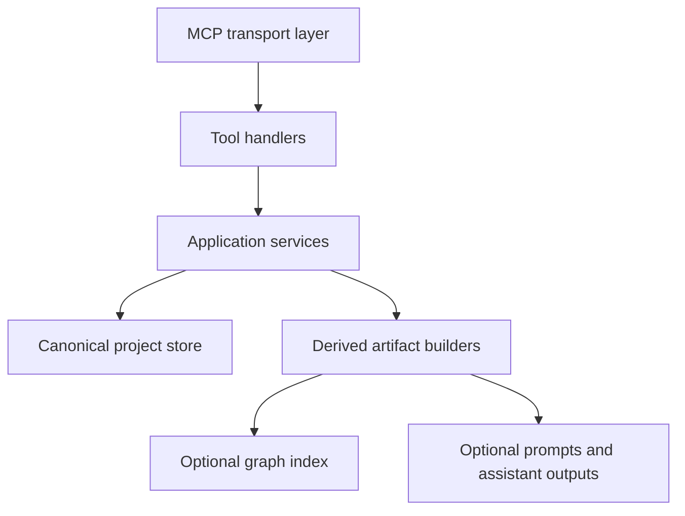

# Scriptorium MCP Architectural Audit

## Executive summary

Scriptorium currently behaves like two products fused together:

- a focused MCP server for structured fiction project management
- an overextended AI co-author platform with prompts, personas, genre packs, event syncing, plugin ontologies, and a Neo4j knowledge graph

The strongest core is the structured project workspace plus a small set of durable writing primitives: projects, chapters, characters, outlines, lore facts, and consistency checks. That is the part worth keeping and hardening.

The weakest parts are the layers that claim deeper integration than they actually provide: the EventBus auto-sync model, the ontology/plugin runtime, and the Neo4j graph story. Those pieces introduce complexity, misleading product messaging, and operational risk without being cleanly wired into the actual user workflows.

## Inferred true product goals

Based on [`package.json`](../package.json:1), [`src/index.ts`](../src/index.ts:1), the tool set under [`src/tools/`](../src/tools), and the sample project data under [`projects/test_grimdark/`](../projects/test_grimdark), the real product should be:

1. An MCP-native writing workspace for book projects
2. A structured persistence layer for project assets on disk
3. A lightweight consistency system for lore, timeline, characters, and chapters
4. Optional advanced graph support for projects that truly need semantic querying
5. Extensible genre/domain schemas only where they materially improve consistency or retrieval

## What the system should keep

### Keep as core capabilities

- [`project_manager`](../src/index.ts:152) style project lifecycle and project directory structure
- chapter persistence and indexing from [`chapterWeaver()`](../src/tools/chapter-weaver.ts:21)
- character persistence from [`characterForger()`](../src/tools/character-forger.ts:20)
- outline persistence from [`storyArchitect()`](../src/tools/story-architect.ts:62)
- lore fact registration and consistency checking from [`loreGuardian()`](../src/tools/lore-guardian.ts:48)
- atomic file operations and lock primitives from [`ProjectService`](../src/services/project-service.ts:15)
- typed domain model direction in [`src/core/domain/entities.ts`](../src/core/domain/entities.ts:1)
- centralized error model direction in [`withErrorHandling()`](../src/utils/error-handler.ts:64)

### Keep only as optional extensions

- Neo4j-backed graph features in [`LoreService`](../src/services/lore-service.ts:32)
- ontology plugins in [`PluginService`](../src/services/plugin-service.ts:50)
- deterministic embeddings in [`embedText()`](../src/utils/text-embedding.ts:22)

These should not define the product. They should support it only after the file-first core is reliable.

## Architectural diagnosis

### Current architecture pattern

The runtime in [`src/index.ts`](../src/index.ts:1) is a monolithic composition root that:

- initializes storage
- loads plugins
- connects to Neo4j
- registers all tools inline
- embeds business logic for [`project_manager`](../src/index.ts:152)
- exposes resources and prompts directly

This makes the entrypoint too large and too responsible. It also mixes:

- bootstrapping
- product messaging
- file system concerns
- graph concerns
- prompt/session authoring
- tool registration

### Actual architecture in practice

There is no consistent layered design across the codebase.

Some modules are relatively mature, such as [`LoreService`](../src/services/lore-service.ts:32) and [`ProjectService`](../src/services/project-service.ts:15).

Other modules bypass those abstractions and write directly to disk, return prompt templates instead of doing work, or duplicate logic already claimed to be centralized.

The result is not one architecture. It is several partially competing architectures:

- file-first tool scripts
- service-oriented internals
- graph-first ambitions
- MCP prompt wrappers for future AI behavior
- event-driven sync claims

## Major findings by area

### 1. Entrypoint and server composition

#### Strengths

- clear tool registration
- straightforward MCP startup
- minimal dependency surface

#### Problems

- [`src/index.ts`](../src/index.ts:1) is oversized and mixes transport setup with product logic
- [`project_manager`](../src/index.ts:152) is implemented inline instead of as a proper tool module
- startup hard-connects to plugins and Neo4j, even though most tools are file-based
- product messaging overstates maturity, for example Living Bible and graph readiness claims in [`src/index.ts`](../src/index.ts:496)

#### Impact

- poor testability
- hard to reason about initialization failures
- difficult future refactors into modular tool packs or optional subsystems

### 2. Tools layer

#### What works

- schemas are present for all tools
- file-first tools are easy to understand
- user-facing capability set is broad

#### What is overengineered or misaligned

Several tools do not actually execute domain logic. They mostly emit AI instructions.

Examples:

- [`proseAlchemist()`](../src/tools/prose-alchemist.ts:74)
- [`seriesPlanner()`](../src/tools/series-planner.ts:21) for title and blurb generation
- [`betaReader()`](../src/tools/beta-reader.ts:60)
- [`researchQuill()`](../src/tools/research-quill.ts:24)

These are closer to prompt templates than product features. They inflate the surface area without increasing durable system value.

#### What is duplicated or inconsistent

- some tools use [`withErrorHandling()`](../src/utils/error-handler.ts:64), others do not
- some tools use [`ProjectService`](../src/services/project-service.ts:15), others write directly via [`fs-extra`](../package.json:13)
- validation rigor varies widely between tools
- naming and messaging are inconsistent across modules

#### High-priority correctness problems

- [`characterForger()`](../src/tools/character-forger.ts:20) uses raw file IO, no wrapper, no atomic writes, and still contains [`any`](../src/tools/character-forger.ts:95) despite the project claiming strict typing
- [`storyArchitect()`](../src/tools/story-architect.ts:62) uses random twist suggestions and file writes directly, with multiple [`any`](../src/tools/story-architect.ts:86)
- [`chapterWeaver()`](../src/tools/chapter-weaver.ts:21) partially uses [`ProjectService`](../src/services/project-service.ts:15) but still keeps untyped mutable index state via [`any[]`](../src/tools/chapter-weaver.ts:28)
- [`worldWeaver()`](../src/tools/world-weaver.ts:26) updates markdown sections via naive string replacement in [`bible.replace()`](../src/tools/world-weaver.ts:114), which is fragile and order-dependent
- [`loreGuardian()`](../src/tools/lore-guardian.ts:48) mixes JSON facts, regex extraction, and Neo4j registration in one function, making it both hard to scale and hard to trust

### 3. Core services

#### [`ProjectService`](../src/services/project-service.ts:15)

This is one of the best parts of the codebase.

Strengths:

- atomic write pattern
- per-resource locks
- reusable project file helpers
- aligned with scalable file-first architecture

Problem:

- it is underused
- tool authors bypass it frequently

Recommendation:

- make [`ProjectService`](../src/services/project-service.ts:15) the required persistence boundary for all file-backed tools

#### [`LoreService`](../src/services/lore-service.ts:32)

This is ambitious and better structured than most of the tools, but it currently exceeds what the product can reliably support.

Strengths:

- proper class boundary
- decent typed domain integration
- graph summary, contradiction, path, and semantic search concepts
- graceful fallback on initial connection failure

Problems:

- the service is much richer than the rest of the product can feed accurately
- auto extraction in [`autoExtractAndRegisterFacts()`](../src/services/lore-service.ts:448) is regex-driven and noisy, but the product language frames it as intelligent graph extraction
- graph relation creation is not meaningfully integrated into mainstream tools
- plugin consistency rules are loaded but not executed anywhere meaningful
- connection fallback is partial: startup continues, but many graph-dependent calls silently degrade or behave differently

Recommendation:

- reduce graph scope to optional advanced indexing and fact lookup until the surrounding workflows are genuinely graph-native

#### [`PluginService`](../src/services/plugin-service.ts:50)

This service is tidy but strategically premature.

Problems:

- duplicates ontology types that already exist in [`src/core/domain/entities.ts`](../src/core/domain/entities.ts:137)
- loaded plugins are mostly used for introspection, not enforcement
- plugin installation and removal exist in service but are not first-class MCP tools
- ontology rules are treated as product-defining despite little execution path

Recommendation:

- keep plugin loading as an experimental extension, not part of the core promise

### 4. Event bus and Living Bible model

[`src/utils/event-bus.ts`](../src/utils/event-bus.ts:1) is currently the most misleading subsystem.

#### Why it is dangerous

- comments and output are in Russian while the rest of the codebase is English, increasing maintenance friction
- it writes to [`./projects/${project}/living_world_bible.md`](../src/utils/event-bus.ts:75) using a hardcoded relative path instead of the configured projects root
- it rewrites the entire Living Bible with a tiny event snapshot, destroying the richer seeded content created in [`project_manager`](../src/index.ts:174) and [`worldWeaver()`](../src/tools/world-weaver.ts:36)
- it is initialized via side-effect import in [`src/index.ts`](../src/index.ts:33) and not actually configured into [`LoreService`](../src/services/lore-service.ts:42)
- its logging path logic differs from [`LOG_FILE`](../src/utils/error-handler.ts:37)
- it claims real-time synchronization but mostly overwrites markdown with shallow event metadata

#### Verdict

This subsystem should be removed or fully redesigned before any scalability work.

### 5. Domain model and typing

[`src/core/domain/entities.ts`](../src/core/domain/entities.ts:1) is directionally good, but the codebase does not actually obey it.

Problems:

- plugin types are duplicated in both [`src/core/domain/entities.ts`](../src/core/domain/entities.ts:137) and [`src/services/plugin-service.ts`](../src/services/plugin-service.ts:19)
- many tools still use local ad hoc shapes and [`any`](../src/tools/chapter-weaver.ts:28)
- runtime persisted data structures are not consistently mapped to domain types
- strict mode in [`tsconfig.json`](../tsconfig.json:2) is undermined by widespread unsafe typing patterns

Recommendation:

- treat the domain model as a contract and force all services and tools through it

### 6. Prompts and product focus

The prompt set in [`src/prompts/genre-prompts.ts`](../src/prompts/genre-prompts.ts:1) and MCP prompts in [`src/index.ts`](../src/index.ts:371) are useful aids, but they are not architecture-critical.

Problems:

- too much of the product surface is prompt packaging rather than system capability
- genre-specific prompts are static content, not architecture
- these modules add breadth but not platform integrity

Recommendation:

- keep prompts as content assets, not as justification for major architectural complexity

### 7. Docker and deployment

#### [`Dockerfile`](../Dockerfile:1)

Problems:

- copies only [`dist/`](../dist) and not [`plugins/`](../plugins), so plugin loading in containers is likely broken
- exposes port 3000 even though stdio MCP servers do not inherently serve HTTP
- environment defaults include a weak password pattern in source form

#### [`docker-compose.yml`](../docker-compose.yml:1)

Problems:

- operationally couples the MCP server to Neo4j even though most capabilities are file-first
- health check and APOC setup imply a graph-centric production stance not matched by the application design
- no separation between optional advanced services and required runtime

Recommendation:

- treat Neo4j as an optional profile, not part of the default architecture

## What is unnecessary or should be deprioritized

### Remove or heavily demote from the product center

- EventBus-driven Living Bible sync in [`src/utils/event-bus.ts`](../src/utils/event-bus.ts:1)
- grand product claims around real-time auto-synced world bible behavior in [`src/index.ts`](../src/index.ts:496)
- graph-heavy marketing language before graph workflows are complete
- AI-instruction-only tools as first-class architectural pillars:
  - [`betaReader()`](../src/tools/beta-reader.ts:60)
  - [`proseAlchemist()`](../src/tools/prose-alchemist.ts:74)
  - [`researchQuill()`](../src/tools/research-quill.ts:24)
  - parts of [`seriesPlanner()`](../src/tools/series-planner.ts:69)

### Simplify

- collapse duplicate World Bible and Living World Bible concepts into one canonical file
- collapse ontology definitions to one type source
- separate file-first consistency from optional graph analytics
- move inline [`project_manager`](../src/index.ts:152) into its own tool module

## What currently works incorrectly or dangerously

### Dangerous or incorrect behavior

1. Living Bible overwrite risk
   - [`syncLivingBible()`](../src/utils/event-bus.ts:72) rewrites the file with minimal event text, effectively destructive

2. Hardcoded path misuse
   - [`event-bus.ts`](../src/utils/event-bus.ts:75) ignores configured root paths

3. False architectural promises
   - plugin consistency rules are loaded but not enforced as real validation workflows
   - Neo4j is described as ready and central while most product actions never depend on graph integrity

4. Inconsistent persistence safety
   - only part of the code uses atomic writes and locks
   - direct writes remain common in tools

5. Container/runtime mismatch
   - plugins likely unavailable inside Docker due to missing copy step in [`Dockerfile`](../Dockerfile:11)

6. Typing debt under strict mode
   - repeated [`any`](../src/tools/story-architect.ts:86) usage weakens maintainability and correctness

7. Silent degradation patterns
   - graph connection fallback hides failure modes instead of clearly surfacing optional feature availability

8. Product duplication
   - both [`world_bible.md`](../src/tools/world-weaver.ts:33) and [`living_world_bible.md`](../src/tools/world-weaver.ts:34) are maintained, increasing drift risk

## Prioritized refactor and cleanup order

### First remove or redesign

1. Remove or disable the current EventBus Living Bible write path
2. Stop maintaining two bible files
3. Move [`project_manager`](../src/index.ts:152) out of [`src/index.ts`](../src/index.ts:1)
4. Make all file-backed tools use [`ProjectService`](../src/services/project-service.ts:15)
5. Standardize all tools on [`withErrorHandling()`](../src/utils/error-handler.ts:64) and typed return paths

### Then simplify core architecture

6. Define one canonical core domain: project, chapter, character, outline, lore fact
7. Split optional graph features behind a capability boundary
8. Reduce plugin system to schema enrichment and introspection until enforcement exists
9. Reclassify prompt-only tools as lightweight assistants, not core product subsystems

### Then restore advanced capability carefully

10. Reintroduce graph-backed consistency only for explicitly supported workflows
11. Add plugin rule execution only after there is a rule runner and stable entity/relation ingestion pipeline
12. Add richer semantic retrieval only after data quality and provenance are reliable

## Concrete cleanup plan for scalability and flexibility

### Phase 1: Focus the product

- define the canonical product as file-first MCP writing workspace
- declare Neo4j optional
- declare plugins optional
- remove Living Bible auto-sync claims until replaced by deterministic rebuild logic

### Phase 2: Normalize architecture

- create a dedicated tool module for [`project_manager`](../src/index.ts:152)
- introduce a small composition layer for tool registration instead of a monolithic [`src/index.ts`](../src/index.ts:1)
- route all persistence through [`ProjectService`](../src/services/project-service.ts:15)
- route all cross-cutting failures through [`withErrorHandling()`](../src/utils/error-handler.ts:64)

### Phase 3: Shrink the core surface

Define core tier:

- projects
- chapters
- characters
- outlines
- lore facts
- consistency check
- project resources

Define extension tier:

- genre prompts
- beta reader personas
- prose style helpers
- research helpers
- series marketing helpers
- plugin ontology browsing
- graph analytics

### Phase 4: Make advanced systems honest and composable

- expose feature flags or capability discovery for graph availability
- expose plugin status as optional metadata, not mandatory platform identity
- implement one rebuildable canonical knowledge representation from file data
- generate derived artifacts from canonical data instead of mutating multiple sources

### Phase 5: Prepare for scale

- introduce module boundaries: `application`, `domain`, `infrastructure`, `mcp`
- add contract tests around project file structures and tool behaviors
- add migration logic for project schema versions
- support background rebuild jobs for optional graph indexes rather than inline writes during every tool action

## Recommended target architecture

### Interpretation

- canonical truth should live in project files
- graph state should be derived, rebuildable, and optional
- prompts should consume state, not define architecture
- extensions should not distort the core runtime

## Concrete keep remove simplify matrix

| Area | Keep | Simplify | Remove or demote |
|---|---|---|---|
| Project storage | Yes | Standardize via [`ProjectService`](../src/services/project-service.ts:15) | No |
| Characters, chapters, outlines, lore facts | Yes | Strong typing and shared persistence | No |
| Neo4j graph | Optional | Derived index only | Remove from core identity |
| Plugin system | Optional | Introspection first | Remove from core promise |
| EventBus sync | No | Replace with rebuild job if needed | Yes |
| Prompt helpers | Yes | Reclassify as content utilities | Remove from core architecture |
| Dual bible files | No | Single canonical document | Yes |
| Inline project manager in entrypoint | No | Dedicated tool module | Yes |

## Immediate next actions for implementation mode

1. delete or disable destructive EventBus bible writes
2. choose one canonical bible file name and migrate all references
3. extract [`project_manager`](../src/index.ts:152) into [`src/tools/project-manager.ts`](../src/index.ts:152)
4. refactor [`characterForger()`](../src/tools/character-forger.ts:20), [`storyArchitect()`](../src/tools/story-architect.ts:62), and [`worldWeaver()`](../src/tools/world-weaver.ts:26) onto [`ProjectService`](../src/services/project-service.ts:15)
5. standardize wrappers, validation, and typed DTOs across all tools
6. mark graph and plugin subsystems as optional capabilities in startup and tool responses
7. reduce prompt-only tools to a secondary package or clearly labeled assistant utilities

## Bottom line

The scalable version of Scriptorium is not a fully event-driven, graph-centric, ontology-heavy AI co-author platform.

The scalable version is a focused MCP writing system with:

- reliable project files as the source of truth
- a small, typed, durable domain model
- optional derived graph capabilities
- optional assistant-style prompt utilities

Everything that fights that direction should be removed, simplified, or demoted.