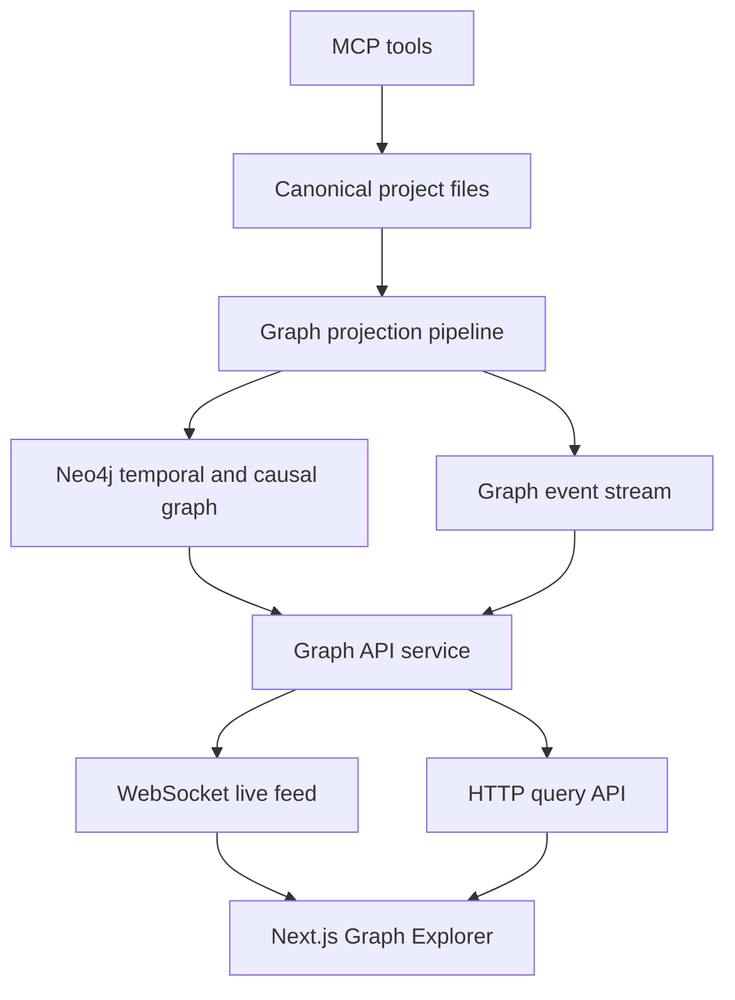

# Scriptorium MCP Next Major Extension Plan

**Status:** Canonical architecture plan for the next major extension  
**Scope:** Visual Graph Explorer, temporal and causal knowledge graph, multilingual support  
**Constraint:** Planning only. No code changes in this task.  
**Source of truth:** This document and the completion message for this architect task.

## 1. Executive summary

Scriptorium should add the next major extension as an **optional graph and web capability layer** built on top of the existing file-first MCP core described in [`plans/ARCHITECTURAL_AUDIT.md`](./ARCHITECTURAL_AUDIT.md).

The extension should deliver three capabilities together because they reinforce each other:

1. A **Visual Graph Explorer** web application so authors can inspect the living story graph in a browser
2. A **temporal and causal graph model** in Neo4j so the system can reason over event order, causation, and future inconsistency risk
3. A **multilingual foundation** so entities, UI labels, and tool-facing text work in English and Russian from the start without splitting the domain model

The scalable approach is:

- keep project files as canonical truth
- treat Neo4j as a derived analytical graph, not the only source of truth
- expose a dedicated HTTP and WebSocket graph service alongside the MCP server
- let the web UI subscribe to live graph deltas instead of rebuilding whole snapshots on every change
- model localization as structured fields and translation catalogs, not duplicated entity records

## 2. Design goals

### Primary goals

- Provide a browser-based graph explorer for projects
- Support live graph updates through WebSocket transport compatible with MCP-era integration patterns
- Extend graph data with temporal fields: `start`, `end`, `duration`
- Add causal modeling so the system can detect and forecast plot-hole risk up to 10 chapters ahead
- Support English and Russian across graph entities, UI, and tool-facing text
- Preserve file-first architecture and optional graph capability boundaries

### Architectural goals

- Keep the MCP server focused on authoring tools
- Introduce a separate application boundary for graph query and live view delivery
- Make graph rebuildable from project files and derived facts
- Make localization explicit in the domain model
- Ensure future expansion to more languages does not require schema redesign

## 3. Current-state implications from the cleaned architecture

Based on [`src/index.ts`](../src/index.ts:1), [`src/services/lore-service.ts`](../src/services/lore-service.ts:32), [`src/core/domain/entities.ts`](../src/core/domain/entities.ts:27), and [`src/utils/event-bus.ts`](../src/utils/event-bus.ts:24), the extension should not be bolted into the current runtime as more inline logic.

### Relevant current strengths

- [`ProjectService`](../src/services/project-service.ts:15) already supports the file-first source-of-truth direction referenced in [`plans/ARCHITECTURAL_AUDIT.md`](./ARCHITECTURAL_AUDIT.md)
- [`LoreService`](../src/services/lore-service.ts:32) already establishes Neo4j as an optional integration point
- [`EntityNode`](../src/core/domain/entities.ts:27) and [`RelationEdge`](../src/core/domain/entities.ts:46) provide a starting canonical graph contract
- the current event model in [`src/utils/event-bus.ts`](../src/utils/event-bus.ts:24) provides a conceptual seed for change notifications, even though it is not suitable for the final live graph architecture

### Current gaps that this extension must address

- [`src/index.ts`](../src/index.ts:1) has no HTTP API surface for a web app
- [`LoreService`](../src/services/lore-service.ts:32) does not model temporal intervals, causal edges, or forecast queries
- [`EntityNode`](../src/core/domain/entities.ts:27) and [`RelationEdge`](../src/core/domain/entities.ts:46) do not carry multilingual fields
- the current event bus in [`src/utils/event-bus.ts`](../src/utils/event-bus.ts:24) logs events but does not provide durable client subscriptions, replay, backpressure strategy, or graph delta semantics
- there is no projection layer from canonical project files into graph-view DTOs for React Flow

## 4. Target extension architecture



### Interpretation

- MCP tools continue writing canonical files first
- a projection pipeline derives graph state from file data and fact data
- Neo4j stores queryable graph structure, temporal intervals, and causal edges
- a graph API service serves both snapshot reads and live updates
- the Next.js app consumes snapshots by HTTP and updates by WebSocket

## 5. Recommended repository structure for the extension

This task does not implement files, but the extension should be designed around a modular structure like this:

```text
src/
  application/
    graph/
    temporal/
    i18n/
  domain/
    graph/
    temporal/
    localization/
  infrastructure/
    neo4j/
    events/
    projections/
    api/
  mcp/
    tools/
web/
  app/
  components/
  features/graph/
  features/timeline/
  features/i18n/
  lib/
```

### Boundary rules

- [`src/index.ts`](../src/index.ts:1) should eventually become a thin MCP composition root only
- the future web app should live under [`web/`](../web) as a separate Next.js application
- graph API and WebSocket responsibilities should be hosted in infrastructure and application layers, not inside MCP tool handlers

## 6. Backend and API changes required

## 6.1 Add a dedicated graph application service

Introduce a backend service layer with responsibilities the MCP server does not currently own:

- graph snapshot queries for a project
- filtered subgraph queries by chapter, entity type, relation type, locale, and confidence
- timeline and forecast queries
- live event fan-out over WebSocket
- graph health and capability reporting

### Core backend modules to add conceptually

- `GraphProjectionService`
- `TemporalReasoningService`
- `CausalReasoningService`
- `GraphQueryService`
- `GraphEventStreamService`
- `LocalizationService`

## 6.2 Add HTTP endpoints for the web UI

Recommended endpoint families:

### Graph read endpoints

- `GET /api/projects/:project/graph`
  - returns initial graph snapshot for React Flow
- `GET /api/projects/:project/graph/subgraph`
  - supports filters: chapter window, node types, edge types, locale, search term
- `GET /api/projects/:project/graph/node/:id`
  - returns localized detail panel payload
- `GET /api/projects/:project/graph/timeline`
  - returns ordered event data for timeline overlays
- `GET /api/projects/:project/graph/forecast`
  - returns plot-hole predictions, confidence, impacted chapters, and causal chain summaries
- `GET /api/capabilities`
  - returns whether graph, forecasting, and locales are available

### Graph mutation or admin endpoints

These should remain internal or operator-only because MCP tools remain the main mutation entry point:

- `POST /api/projects/:project/graph/rebuild`
- `POST /api/projects/:project/graph/reindex`
- `POST /api/projects/:project/graph/localize/rebuild`

## 6.3 Add WebSocket live feed

The live feed should be **delta-oriented**, not full-state-oriented.

### Subscription model

- clients connect to `ws://.../ws/projects/:project/graph`
- clients send subscription filters after connect
- server responds with ack, snapshot version, and optional initial diff cursor

### Event families

- `graph.snapshot.ready`
- `graph.node.upserted`
- `graph.node.removed`
- `graph.edge.upserted`
- `graph.edge.removed`
- `graph.timeline.updated`
- `graph.forecast.updated`
- `graph.rebuild.started`
- `graph.rebuild.completed`
- `graph.capability.changed`

### Event payload requirements

- `project`
- `version`
- `eventId`
- `timestamp`
- `locale`
- `entity payload` or `edge payload`
- optional `diff reason`
- optional `cursor`

### Why not reuse [`src/utils/event-bus.ts`](../src/utils/event-bus.ts:24)

The current event bus is process-local and log-centric. It should be treated as an internal audit utility seed, not the live graph transport. The live graph feed needs:

- versioned replayable events
- WebSocket fan-out
- snapshot plus delta coordination
- filtering per project and locale
- resilience to client reconnects

## 6.4 Add graph projection pipeline

Graph state should be derived from canonical project artifacts:

- [`project.json`](../projects/test_grimdark/project.json)
- [`world_bible.md`](../projects/test_grimdark/world_bible.md)
- [`outline.json`](../projects/test_grimdark/outline.json)
- chapter markdown under [`projects/test_grimdark/chapters/`](../projects/test_grimdark/chapters)
- character files under [`projects/test_grimdark/characters/`](../projects/test_grimdark/characters)
- lore facts from [`lore_facts.json`](../projects/test_grimdark/lore_facts.json)

### Projection stages

1. Parse canonical file artifacts into typed domain records
2. Normalize entities and aliases
3. Extract temporal events and intervals
4. Build causal hypotheses and explicit causal relations
5. Persist graph nodes and edges into Neo4j
6. Emit graph deltas to WebSocket subscribers
7. Recompute forecast risk summaries for affected chapter windows

### Projection triggers

- synchronous lightweight enqueue after tool writes
- background rebuild on project import or schema migration
- manual operator rebuild

## 7. Neo4j temporal knowledge graph and causal reasoning model

## 7.1 Domain model extension

The current contracts in [`EntityNode`](../src/core/domain/entities.ts:27), [`RelationEdge`](../src/core/domain/entities.ts:46), and [`TimelineEvent`](../src/core/domain/entities.ts:104) are too thin for temporal and multilingual reasoning.

The target model should add these concepts.

### Node categories

- `Project`
- `Entity`
- `Event`
- `Chapter`
- `Scene` later, not in the first rollout
- `TimelineMarker`
- `Constraint`
- `ForecastRisk`

### Core temporal fields

For entities, relations, and events where relevant:

- `start`
- `end`
- `duration`
- `temporalPrecision` such as exact, approximate, inferred, unknown
- `timelineAxis` such as story_time, narration_time, publication_time
- `chapterSpanStart`
- `chapterSpanEnd`

### Core causal fields

- `causeConfidence`
- `causalPolarity` such as enables, blocks, triggers, explains
- `causalDistance`
- `evidenceSource`
- `forecastHorizonChapters`

## 7.2 Recommended graph relations

Retain existing semantic relations and add temporal and causal ones.

### Temporal relations

- `OCCURS_IN_CHAPTER`
- `PRECEDES`
- `OVERLAPS_WITH`
- `STARTS_AT`
- `ENDS_AT`
- `ACTIVE_DURING`
- `INTRODUCED_IN`

### Causal relations

- `CAUSES`
- `ENABLES`
- `PREVENTS`
- `REVEALS`
- `DEPENDS_ON`
- `VIOLATES_CONSTRAINT`
- `FORESHADOWS`

### Forecast relations

- `RISKS_CAUSING`
- `LIKELY_CONTRADICTS`
- `MISSING_PRECONDITION_FOR`

## 7.3 Forecasting plot holes up to 10 chapters ahead

The requirement should be framed as **bounded forecast reasoning**, not omniscient prediction.

### Proposed forecast pipeline

1. Build causal dependency chains from current events, constraints, and entity state
2. Identify unresolved prerequisites for planned beats and observed world rules
3. Project these dependencies across the next 10 chapters using outline beats, timeline events, and known chapter progression
4. Produce risk records with confidence and explanation
5. Surface them both in MCP tool responses and in the web UI

### Forecast output schema

Each forecast risk should include:

- risk id
- affected project
- window start chapter
- window end chapter
- risk type
- summary
- causal chain
- violated rule or missing dependency
- impacted entities
- confidence score
- recommended remediation pattern
- supporting evidence references

### Example risk classes

- unresolved death or survival dependency
- impossible travel interval
- romance arc state regression without cause
- investigation reveal without evidence path
- historical or social constraint violation
- weapon, artifact, or clue appears without introduction
- alliance shift without causal trigger
- contradiction between outline beat and established lore

## 7.4 Neo4j implementation guidance

### Schema additions

Add indexes and constraints for:

- event id
- project plus chapter span
- temporal start and end lookups
- forecast risk ids
- localized text availability markers if stored in graph

### Query patterns needed

- chapter-window subgraph query
- temporal overlap and gap detection
- causal chain traversal
- missing prerequisite detection
- next-10-chapter forecast traversal
- risk aggregation by chapter and entity

### APOC and procedures

Use APOC only where it materially simplifies path expansion or periodic rebuild jobs. Do not make forecasting correctness depend on APOC-specific behavior if a pure Cypher alternative is feasible.

## 8. Visual Graph Explorer web app plan

## 8.1 App purpose

The web app should be an analyst and exploration interface, not a full second authoring surface.

### Core user outcomes

- inspect the living graph for a project
- filter by chapter range, entity type, relation type, confidence, and locale
- view node and edge details with provenance and localization
- see temporal overlays and causal chain highlights
- inspect forecasted plot-hole risks and navigate to their causal evidence
- observe live changes without reloading the page

## 8.2 Recommended Next.js structure

```text
web/
  app/
    layout.tsx
    page.tsx
    projects/
      [project]/
        page.tsx
        graph/
          page.tsx
        timeline/
          page.tsx
        risks/
          page.tsx
  components/
    graph/
      GraphCanvas.tsx
      GraphControls.tsx
      GraphLegend.tsx
      NodeDetailsPanel.tsx
      EdgeDetailsPanel.tsx
      ForecastPanel.tsx
      TimelineMiniMap.tsx
    layout/
    i18n/
  features/
    graph/
      api.ts
      dto.ts
      mappers.ts
      store.ts
      websocket.ts
    timeline/
    forecast/
    i18n/
  lib/
    react-flow/
    websocket/
    formatting/
```

## 8.3 UI architecture

### Main screens

- Project graph explorer
- Timeline view
- Risk and forecast view
- Node details drawer
- Connection and capability status panel

### React Flow responsibilities

- render node and edge projections only
- keep layout metadata client-side
- apply visual styles by entity type, confidence, and risk state
- support expanding or collapsing neighborhoods on demand
- support causal-path highlight mode

### State model

Use a dedicated client store for:

- current project
- locale
- graph snapshot version
- selected node or edge
- active filters
- live connection state
- forecast results

### Live update behavior

- HTTP fetch for initial graph snapshot
- WebSocket subscription for deltas
- optimistic UI is not needed initially because the UI is read-heavy
- reconnect should refetch snapshot if cursor recovery fails

## 8.4 Graph DTO shape for React Flow

The API should not expose raw Neo4j records to the browser.

### Node DTO

- `id`
- `type`
- `position`
- `data.label`
- `data.localizedLabel`
- `data.description`
- `data.chapterRange`
- `data.temporalState`
- `data.riskLevel`
- `data.tags`
- `data.provenanceSummary`

### Edge DTO

- `id`
- `source`
- `target`
- `type`
- `label`
- `localizedLabel`
- `confidence`
- `temporalQualifier`
- `causalQualifier`
- `riskHighlight`

## 9. Multilingual support model

## 9.1 Design principle

Localization should be implemented at three separate layers that interoperate cleanly:

1. **Domain content localization** for graph entities and facts
2. **UI localization** for the web explorer
3. **Tool-facing localization** for MCP responses and prompts

These layers must not be conflated.

## 9.2 Entity localization model

Do not create separate English and Russian nodes for the same story entity.

Instead, represent one canonical entity with localized fields.

### Recommended localized value shape

```json
{
  "defaultLocale": "en",
  "translations": {
    "en": {
      "name": "Iron Throne Citadel",
      "description": "Main fortress of the ruling house"
    },
    "ru": {
      "name": "Цитадель Железного Трона",
      "description": "Главная крепость правящего дома"
    }
  }
}
```

### Localization rules

- canonical entity id remains locale-neutral
- one locale is the authoring source for any given field
- other locales may be translated, human-authored, or machine-assisted
- provenance must track translation origin
- search should support both localized names and aliases
- alias matching should be locale-aware

### Fields that should support localization

- entity display name
- entity description
- observation summaries exposed to UI
- relation labels exposed to UI
- risk summaries and recommendations
- chapter and world labels shown in the explorer

## 9.3 UI localization model

The web app should use catalog-based UI translations.

### Recommended policy

- all chrome text in translation catalogs
- locale routing with `en` and `ru`
- date and number formatting per locale
- graph legends, filters, empty states, and forecast explanations localized
- fallback to English if Russian string is missing

## 9.4 Tool-facing localization model

MCP tool responses should gain a consistent locale-aware formatting path.

### Recommended behavior

- keep internal storage locale-neutral where possible
- let tool handlers accept optional locale in future schema revisions
- localize user-facing summaries and validation messages through a common formatter
- preserve canonical keys and ids regardless of response language

### Important constraint

Tool-facing text should be localized, but tool names and core protocol identifiers should remain stable and language-neutral.

## 9.5 Translation provenance and quality

For translated fields, store:

- locale
- source locale
- translated by human or machine
- timestamp
- confidence or review status

This matters because forecast and contradiction explanations must be trustworthy and explainable.

## 10. Data model changes required

The domain model should be extended conceptually beyond [`src/core/domain/entities.ts`](../src/core/domain/entities.ts:1).

### Add localized text primitives

- `LocalizedText`
- `LocalizedFieldMap`
- `TranslationMetadata`

### Extend entity and relation contracts

Add optional fields such as:

- `displayName`
- `localized`
- `temporal`
- `causal`
- `introducedInChapter`
- `activeChapterRange`

### Add event and forecast contracts

- `GraphEventRecord`
- `TemporalInterval`
- `CausalLink`
- `ForecastRisk`
- `GraphSnapshot`
- `GraphDelta`
- `CapabilityDescriptor`

## 11. Integration with MCP tools

The extension should integrate with the current tools without turning every tool into a graph orchestrator.

### Rules

- existing tools continue writing canonical files first
- after successful writes, tools enqueue graph projection work
- graph rebuild happens asynchronously for heavier updates
- read tools may optionally include graph-derived summaries when graph capability is available
- forecast results should primarily surface through [`lore_guardian`](../src/tools/lore-guardian.ts:48) and future dedicated graph tools

### Recommended MCP additions later

Not part of this architect implementation task, but likely needed later:

- `graph_explorer_status`
- `graph_rebuild`
- `forecast_plot_holes`
- `set_project_locale`
- `localize_entity`

## 12. Risks

### Architectural risks

- adding a web app directly into the monolithic MCP entrypoint would worsen coupling
- treating Neo4j as the source of truth would reintroduce divergence risk
- letting localization duplicate entities per language would fragment the graph
- making forecast logic synchronous in write paths would hurt tool responsiveness

### Product risks

- users may over-trust forecast outputs as certainty rather than risk estimation
- noisy causal inference can damage confidence in the system
- incomplete translations can make graph exploration feel inconsistent
- large projects may produce visually overwhelming graphs without strong filtering

### Operational risks

- WebSocket fan-out and rebuild jobs introduce new runtime complexity
- Neo4j query cost may rise sharply with path expansion and forecast traversals
- localization plus full-text search may need careful indexing strategy
- deployment now includes MCP server, optional Neo4j, and web app coordination

## 13. Non-goals

The first major extension should explicitly avoid these goals:

- full browser-based manuscript editing
- collaborative real-time text editing
- automatic translation of entire manuscripts
- perfect plot prediction or autonomous story planning
- support for more than English and Russian in the initial release
- scene-level temporal modeling in phase one
- replacing MCP tools with the web UI

## 14. Phased rollout

## Phase 1: Domain and projection foundation

- extend domain contracts for localization, temporal intervals, and causal links
- create graph projection pipeline from canonical project files
- refactor graph capability behind dedicated services rather than direct ad hoc usage in [`LoreService`](../src/services/lore-service.ts:32)
- add capability reporting

**Exit criteria**

- project files can be projected into Neo4j with temporal metadata
- graph rebuild is deterministic and repeatable
- domain contracts support `en` and `ru`

## Phase 2: Graph API and live feed

- add HTTP graph read API
- add WebSocket project graph feed with snapshot and delta semantics
- add graph versioning and cursor-based reconnect behavior
- expose operator rebuild endpoints

**Exit criteria**

- clients can fetch snapshots and receive deltas for one project reliably
- graph event stream survives reconnect with version checks

## Phase 3: Next.js Visual Graph Explorer

- create [`web/`](../web) Next.js app
- implement project graph explorer with React Flow
- add localized UI chrome
- add node detail, edge detail, and graph filter panels
- add connection and capability indicators

**Exit criteria**

- a writer can open a project in the browser and inspect a live graph in English or Russian

## Phase 4: Temporal and causal reasoning

- add temporal interval queries
- add causal relation materialization
- implement risk detection for the next 10 chapters
- surface forecast chains in API and UI

**Exit criteria**

- the system can produce explainable forecast risks with evidence and confidence

## Phase 5: Quality hardening and adoption

- tune graph layouts and filters for large projects
- improve search relevance across locales
- add localization review workflows
- add observability for graph rebuilds, feed latency, and forecast accuracy

**Exit criteria**

- extension is stable under larger projects and provides trustworthy multilingual outputs

## 15. Implementation order recommendation

1. Define domain extensions for localization, temporal intervals, and forecast risk
2. Separate graph services from current monolithic entry patterns in [`src/index.ts`](../src/index.ts:1)
3. Implement deterministic graph projection from canonical files
4. Extend Neo4j schema and query layer for temporal and causal relations
5. Add HTTP snapshot API and capability endpoint
6. Add WebSocket snapshot plus delta feed
7. Build Next.js app shell and graph explorer pages
8. Integrate React Flow node and edge DTOs
9. Add multilingual UI catalogs and localized graph rendering
10. Add forecast queries and risk panels
11. Harden rebuilds, observability, and reconnect behavior

## 16. Dependencies and prerequisites

### Technical prerequisites

- preserve the file-first source-of-truth model from [`plans/ARCHITECTURAL_AUDIT.md`](./ARCHITECTURAL_AUDIT.md)
- keep Neo4j optional but fully supported when enabled
- introduce a web-serving runtime boundary instead of extending only stdio MCP transport
- add schema migration strategy for persisted graph metadata

### Organizational prerequisites

- define which locale is authoritative for initial authoring per project
- define minimum acceptable translation quality for UI and graph content
- define how forecast confidence is communicated to users to avoid false certainty

## 17. Recommendation on delivery strategy

This extension should be built as a **new optional subsystem** rather than a rewrite of the current MCP authoring core.

That means:

- no change to the canonical file-first contract
- no hard dependency on the web UI for tool usage
- no assumption that graph capability is always online
- clear capability discovery for MCP and browser clients

## 18. Bottom line

The next major extension for Scriptorium MCP should be a **derived graph platform** composed of:

- a dedicated graph API and WebSocket service
- a Next.js plus React Flow explorer under [`web/`](../web)
- a Neo4j temporal and causal graph model that can forecast risk up to 10 chapters ahead
- a multilingual architecture that keeps one canonical entity per concept and layers English and Russian localization on top

This plan preserves the cleaned architecture direction in [`plans/ARCHITECTURAL_AUDIT.md`](./ARCHITECTURAL_AUDIT.md), scales beyond the current monolithic runtime in [`src/index.ts`](../src/index.ts:1), and creates a clear phased path for implementation without implementing code in this task.
